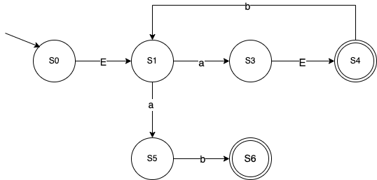

# Discussion 6 - Friday, March 10th

## Reminders
1. Project 2b due March 12th 11:59PM
2. Exam 1 is **next Tuesday** March 14th
3. Quiz 2 regrade requests open until March 16th
3. Quiz 3 is **next Friday in discussion** March 17th

## NFA and DFA
### Key Differences between NFA and DFA:
- NFA can have ε-transition(s) between states.
- NFA states can have multiple transitions going out of them using the same symbol.

### Formal Definition
A DFA is a 5-tuple (Σ, Q, q0, F, δ) where
- Σ is an alphabet
- Q is a nonempty set of states
- q0 ∈ Q is the start state
- F ⊆ Q is the set of final states
- δ : Q x Σ → Q specifies the DFA's transitions

### Review

1. What are some strings that would be accepted by this NFA?

    

## Converting from NFA to DFA
    
Reducing NFA to DFA uses two subroutines: e-closure and move.
    
### ε-closure
`ε-closure(δ, p)` returns the set of states reachable from p using ε-transitions alone.

- ε-closure(p1) = { p1, p2, p3 }
- ε-closure(p2) = { p2, p3 }
- ε-closure(p3) = { p3 }
- ε-closure( { p1, p2 } ) = { p1, p2, p3 } ∪ { p2, p3 }

### move
`move(δ,p,σ)` returns the set of states reachable from p using exactly one transition on symbol σ.

- move(p1, a) = { p2, p3 }
- move(p1, b) = ∅
- move(p2, a) = ∅
- move(p2, b) = { p3 }
- move(p3, a) = ∅
- move(p3, b) = ∅
- move( {p1, p2} , b) = { p3 }

### Algorithm
Let $r_0$ = $\varepsilon\text{-closure}(\delta, q_0)$, add it to $R$\
While $\exists$ an unmarked state $r \in R$:\
&nbsp;&nbsp;&nbsp;&nbsp;&nbsp;&nbsp;Mark $r$\
&nbsp;&nbsp;&nbsp;&nbsp;&nbsp;&nbsp;For each $\sigma \in \Sigma$\
&nbsp;&nbsp;&nbsp;&nbsp;&nbsp;&nbsp;&nbsp;&nbsp;&nbsp;&nbsp;&nbsp;&nbsp;Let $E = \text{move}(\delta, r, \sigma)$\
&nbsp;&nbsp;&nbsp;&nbsp;&nbsp;&nbsp;&nbsp;&nbsp;&nbsp;&nbsp;&nbsp;&nbsp;Let $e = \varepsilon\text{-closure}(\delta, E)$\
&nbsp;&nbsp;&nbsp;&nbsp;&nbsp;&nbsp;&nbsp;&nbsp;&nbsp;&nbsp;&nbsp;&nbsp;If $e \notin R$\
&nbsp;&nbsp;&nbsp;&nbsp;&nbsp;&nbsp;&nbsp;&nbsp;&nbsp;&nbsp;&nbsp;&nbsp;&nbsp;&nbsp;&nbsp;&nbsp;&nbsp;&nbsp;Let $R = R \cup \\{e\\}$\
&nbsp;&nbsp;&nbsp;&nbsp;&nbsp;&nbsp;&nbsp;&nbsp;&nbsp;&nbsp;&nbsp;&nbsp;Let $\delta' = \delta \cup \\{ r, \sigma, e \\} $\
Let $F = \\{r \mid \exists s \in r \text{ with } s \in F_n \\}$

### Practice
Convert the following NFAs to their DFAs.

